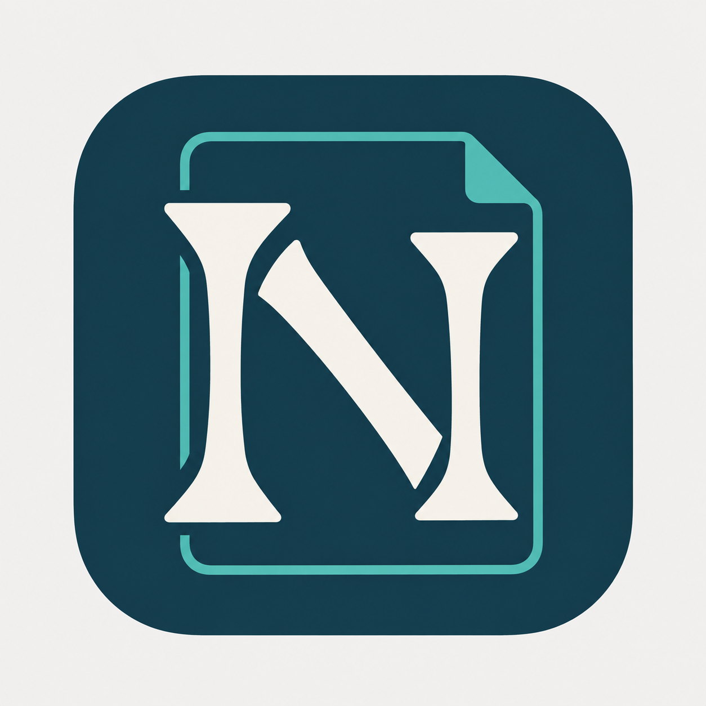
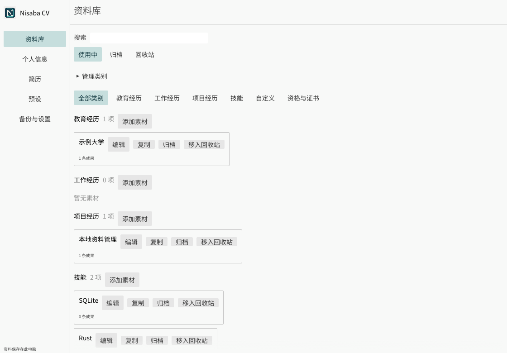
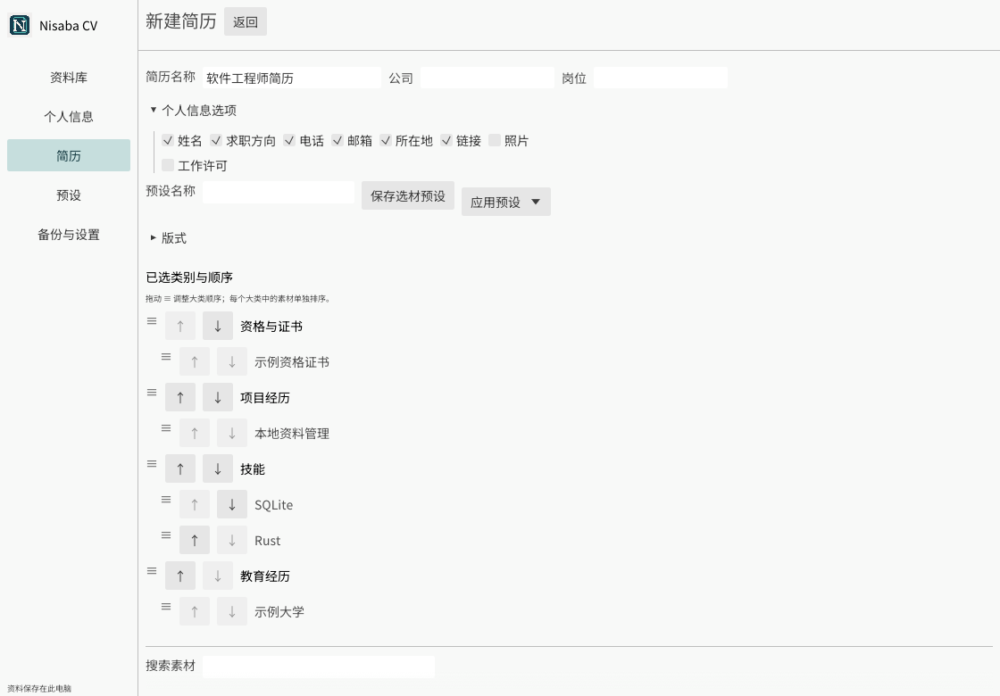

# Nisaba CV



一个轻量的 Windows 本地简历工具：积累个人信息、经历和技能，按岗位挑选素材，生成可独立修改的简历，再导出 PDF。

**当前版本：v1.0。** 无需账号，核心功能可离线使用；原生界面无需 WebView2。适用于 Windows 10 / 11 x64，目前主要验证环境为 Windows 10 22H2。

## 下载与使用

在本仓库的 **Releases** 页面下载 `Nisaba-CV-v1.0-windows-x64.exe`。运行后选择新目录或已有空文件夹，默认文件夹名为 **Nisaba CV**；解压后双击其中的 `Nisaba-CV.exe`。请保留整个文件夹，字体和排版工具已随包提供。

这是便携自解压包，不需要管理员权限，不注册系统卸载项，也不安装额外运行组件。请选可写目录，例如 `D:\Nisaba CV`。目录已包含文件时会拒绝解压，以保护已有资料。

1. 在“个人信息”录入基础资料和自定义字段。
2. 在“资料库”按类别维护教育、工作、项目、技能及自定义素材。
3. 新建简历，安排大类，再选择其中的素材和成果。简历中的改写保持独立。
4. 保存后预览、导出 PDF；版本历史可查看原始 PDF，备份页面可导出完整备份。

资料默认保存在程序旁的 `nisaba-data/`。升级建议将新版本解压到空目录，再导入旧版完整备份。删除整个目录会同时删除默认资料，请先备份。导出到其他位置的 PDF、备份需要自行保管。





## 功能

- 本地个人信息、经历、技能和自定义类别库。
- 类别及类内素材排序，按成果选材，独立简历编辑。
- 选材预设、版式设置、照片、自定义字段。
- 中文 A4 PDF、多页预览、可选择和搜索的文字。
- 命名版本、原始历史 PDF、完整备份和自动备份。

当前不提供 Word 导出、云同步或其他操作系统的发行包。Win11、干净系统、物理断网、真实输入法候选窗与系统 DPI 的完整实机覆盖仍待补充。v1.0 是首个公开版本号，不表示这些环境已经全部验收。发行文件暂未进行代码签名。

## 开发与维护

源码分为 `crates/resume-core`（资料、版本和备份）与 `crates/nisaba-cv`（原生界面与 PDF）。字体和图标在 `assets/`，发行脚本在 `scripts/`，自解压脚本在 `packaging/`。

开发需要 Windows x64、Rust 工具链、Visual Studio C++ 桌面开发组件（MSVC 与 Windows SDK）。制作自解压包还需要 NSIS。详见 [构建说明](docs/BUILD.md)、[维护说明](CONTRIBUTING.md) 与 [上传 GitHub](docs/GITHUB.md)。普通用户无需安装这些开发工具。

```powershell
./scripts/prepare-runtime.ps1
cargo test --workspace --locked
cargo clippy --workspace --all-targets --locked -- -D warnings
./scripts/build.ps1
./scripts/package.ps1
```

运行时工具和发行文件不提交到源码仓库；字体及其许可随源码保留。`Cargo.lock` 应提交，确保依赖版本明确。

## AI 开发声明

Nisaba CV 在需求讨论、架构设计、代码实现、文档编写和测试设计中使用了生成式 AI 辅助；图标也由 AI 辅助生成并由维护者选择。AI 辅助开发是本项目的公开开发背景。

维护者负责代码审阅、功能取舍、测试和最终发布。AI 生成内容可能存在错误；测试通过不代表所有设备和使用场景均已覆盖。发现问题请在仓库 Issues 中反馈复现步骤，示例资料请使用匿名内容。

应用本身不调用大模型、不要求 API Key、无需 AI 账号。个人信息、素材和简历在本机处理；本声明不表示运行时会把用户资料发送给 AI 服务。

项目源码按 MIT 许可证发布。第三方字体、排版工具和依赖遵循各自许可证。Nisaba CV 是独立个人开源项目，不是 AI 服务提供商的官方产品。

## 许可证

项目源码采用 [MIT](LICENSE) 许可证。第三方依赖、Typst、字体及微软运行库适用各自许可，见 [第三方说明](third-party/README.md)。问题与建议请通过本仓库 Issues 提交，避免附带真实简历或个人资料。
